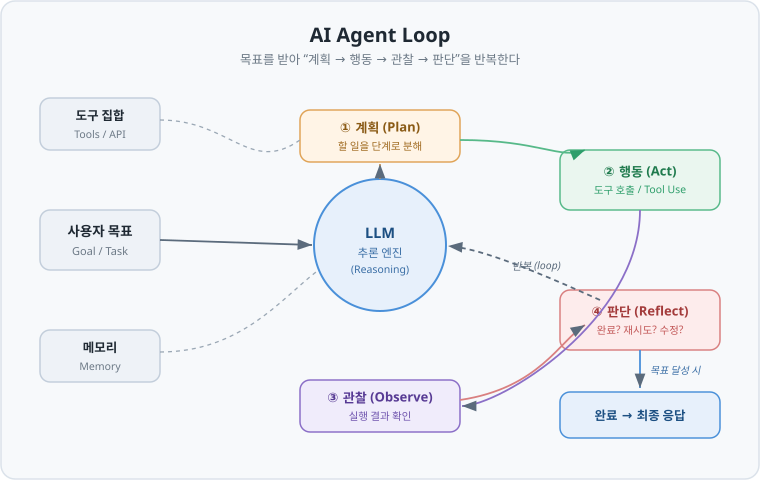

# AI Agent (AI 에이전트)

> LLM을 "추론 엔진"으로 삼아, 스스로 계획을 세우고 도구를 사용하며 목표를 달성할 때까지 반복 실행하는 시스템.

---

## 1. 정의

**AI 에이전트**란 LLM이 단순히 한 번 답하고 끝나는 것이 아니라, **목표(goal)를 받아 스스로 다음 행동을 결정하고, 도구를 호출해 실행하고, 그 결과를 관찰한 뒤 다음 행동을 다시 정하는 과정을 반복**하는 시스템이다.

핵심은 **제어 흐름(control flow)을 LLM이 결정한다**는 점이다. 정해진 순서를 그대로 따라가는 것이 아니라, 매 단계에서 "이제 무엇을 할지"를 LLM이 판단한다.

### 비유: 자판기 vs 신입 직원

| 구분 | 자판기 (단순 LLM 호출) | 신입 직원 (에이전트) |
|------|----------------------|---------------------|
| 입력 | 버튼을 누르면 | "이 업무 처리해줘" |
| 처리 | 정해진 상품이 나옴 | 필요한 자료를 찾고, 계산기를 쓰고, 중간 결과를 확인하며 진행 |
| 경로 | 항상 고정 | 상황에 따라 스스로 결정 |
| 실패 시 | 그대로 실패 | 다시 시도하거나 방법을 바꿈 |

단순 LLM 호출은 "입력 → 출력"의 자판기다. 에이전트는 목표만 주면 **스스로 과정을 설계**하는 신입 직원에 가깝다.

### 워크플로우(Workflow)와의 경계

에이전트와 자주 혼동되는 것이 **워크플로우**다. 둘 다 여러 단계로 이루어지지만 결정 주체가 다르다.

| 구분 | 워크플로우 (Workflow) | 에이전트 (Agent) |
|------|----------------------|-----------------|
| 경로 결정 | 개발자가 코드로 미리 고정 | LLM이 런타임에 동적으로 결정 |
| 예측 가능성 | 높음 (항상 같은 경로) | 낮음 (입력마다 경로가 달라질 수 있음) |
| 적합한 경우 | 단계가 명확히 정해진 작업 | 사전에 경로를 알 수 없는 작업 |
| 예시 | "요약 → 번역 → 저장"을 항상 순서대로 | "이 질문 해결에 필요한 도구를 알아서 골라 실행" |

> 실무 원칙: **경로를 미리 알 수 있으면 워크플로우, 알 수 없으면 에이전트.** 에이전트는 강력하지만 그만큼 비싸고 불안정하므로, 워크플로우로 충분한 문제에 에이전트를 남용하지 않는 것이 좋다.

---

## 2. 왜 필요한가

단순 LLM 호출이나 RAG만으로 처리하기 어려운 문제들이 있다. 에이전트는 다음 상황에서 가치를 발휘한다.

| 필요성 | 설명 | 예시 |
|--------|------|------|
| **다단계 작업** | 한 번의 추론으로 끝나지 않고 여러 단계가 필요 | "경쟁사 3곳의 최근 실적을 조사해 비교표를 만들어줘" |
| **동적 경로** | 상황에 따라 다음 단계가 달라짐 | 검색 결과가 부실하면 다른 키워드로 재검색 |
| **외부 상호작용** | 실시간 데이터 조회, 외부 시스템 조작 | API 호출, DB 조회, 파일 조작, 코드 실행 |
| **자기 교정** | 결과를 스스로 점검하고 수정 | 코드를 실행해 에러가 나면 고쳐서 재실행 |

핵심은 **"경로를 미리 설계할 수 없는 문제"**를 다룰 수 있다는 것이다. 사람이 모든 분기(if-else)를 코딩하는 대신, LLM에게 판단을 위임한다.

---

## 3. 구성요소

에이전트는 크게 네 가지 축으로 구성된다.

| 구성요소 | 역할 | 비유 |
|---------|------|------|
| **LLM (추론 엔진)** | 다음에 무엇을 할지 판단하는 두뇌 | 직원의 사고력 |
| **계획 (Planning)** | 목표를 실행 가능한 단계로 분해 | 업무 계획서 |
| **도구 (Tools)** | LLM이 외부와 상호작용하는 수단 | 계산기, 검색엔진, API |
| **메모리 (Memory)** | 대화·중간결과·과거 경험을 저장 | 메모장, 업무 노트 |

### 3.1 LLM (추론 엔진)

에이전트의 중심. 매 단계에서 현재 상황을 보고 "다음 행동"을 결정한다. 에이전트의 성능은 이 LLM의 추론 능력에 크게 좌우된다.

### 3.2 도구 (Tools)

LLM은 텍스트만 생성할 뿐, 실제로 웹을 검색하거나 코드를 실행할 수는 없다. **도구**는 이 간극을 메운다.

- LLM이 "이 도구를 이런 인자로 호출하겠다"는 **구조화된 출력**(예: JSON)을 생성
- 실행 계층이 실제로 그 함수/API를 실행
- 결과를 다시 LLM에게 전달

이 메커니즘이 **함수 호출(Function Calling / Tool Calling)**이다. 여러 도구의 연결 방식을 표준화한 프로토콜로 **MCP(Model Context Protocol)** 같은 규격이 쓰이기도 한다.

### 3.3 메모리 (Memory)

| 유형 | 저장 대상 | 구현 방식 |
|------|----------|----------|
| **단기 메모리** | 현재 세션의 대화·중간 결과 | 컨텍스트 윈도우 (프롬프트에 누적) |
| **장기 메모리** | 세션을 넘어 유지되는 지식·경험 | 벡터 DB, 외부 저장소 |

컨텍스트 윈도우에는 한계가 있으므로, 무엇을 남기고 무엇을 버릴지 관리하는 것이 중요하다. 오래된 대화를 요약하거나, 중요도가 낮은 중간 결과를 잘라내는 식으로 한정된 컨텍스트를 효율적으로 관리한다.

---

## 4. 흐름 (Agent Loop)

에이전트의 동작은 하나의 **반복 루프**로 요약된다.



```
목표 입력
   │
   ▼
① 계획(Plan)   → 무엇을 해야 하는지 판단
   │
   ▼
② 행동(Act)    → 도구를 호출해 실행
   │
   ▼
③ 관찰(Observe) → 실행 결과를 확인
   │
   ▼
④ 판단(Reflect) → 완료? 재시도? 방법 변경?
   │
   ├─ 미완료 → ① 로 돌아가 반복
   └─ 완료   → 최종 응답 반환
```

이 루프는 **목표가 달성되었다고 LLM이 판단하거나, 최대 반복 횟수에 도달할 때까지** 계속된다. 최대 반복 횟수 제한은 무한 루프와 비용 폭주를 막는 안전장치다.

이 루프를 안정적으로 돌리려면 반복 제어, 도구 결과 파싱, 에러 처리, 타임아웃 같은 실행 골격(harness)이 함께 갖춰져야 한다. 즉, 에이전트의 성능은 LLM의 추론 능력뿐 아니라 이 루프를 감싸는 실행 환경의 견고함에도 좌우된다.

---

## 5. 핵심 개념

에이전트를 설계하는 대표적인 패턴들이다.

### 5.1 ReAct (Reasoning + Acting)

가장 기본이 되는 패턴. **생각(Thought) → 행동(Action) → 관찰(Observation)**을 한 단계씩 번갈아 진행한다.

```
Thought: 최신 환율이 필요하다. 검색 도구를 써야겠다.
Action: search("USD KRW 환율")
Observation: 1 USD = 1,380 KRW
Thought: 이제 계산할 수 있다.
Action: calculate(100 * 1380)
Observation: 138000
Thought: 답을 낼 수 있다.
```

추론 과정을 **명시적으로 텍스트로 드러내기 때문에** 디버깅이 쉽고, 각 단계마다 새 정보를 반영할 수 있다. 대부분의 에이전트 프레임워크의 기본 동작 방식이다.

### 5.2 Plan-and-Execute (계획 후 실행)

ReAct가 "한 걸음씩" 진행한다면, 이 패턴은 **먼저 전체 계획을 세운 뒤 순서대로 실행**한다.

| 구분 | ReAct | Plan-and-Execute |
|------|-------|------------------|
| 계획 시점 | 매 단계마다 즉흥적으로 | 시작 시 전체를 한 번에 |
| 장점 | 유연함, 새 정보에 즉각 반응 | 방향성 유지, 계획 재사용 가능 |
| 단점 | 긴 작업에서 길을 잃기 쉬움 | 초기 계획이 틀리면 전체가 흔들림 |
| 적합 | 짧고 탐색적인 작업 | 길고 구조가 명확한 작업 |

### 5.3 Reflection / Self-Critique (반성)

에이전트가 **자신의 결과물을 스스로 평가하고 개선**하는 패턴. 생성한 답을 "비평가" 역할로 다시 검토한 뒤, 문제가 있으면 수정한다.

- 예: 코드를 작성 → 실행 → 에러 발생 → 에러 메시지를 보고 수정 → 재실행
- 품질은 올라가지만 LLM 호출이 늘어 **비용·지연이 증가**하는 트레이드오프가 있다.

### 5.4 Tool Use (도구 사용 / Function Calling)

LLM이 외부 기능을 호출하는 메커니즘. 도구의 이름·설명·인자 스키마를 LLM에 제공하면, LLM이 적절한 도구와 인자를 골라 **구조화된 형태로 호출을 요청**한다.

- 도구 설명(description)의 품질이 도구 선택 정확도를 좌우한다.
- 도구가 너무 많으면 LLM이 혼란스러워하므로, 관련 도구만 노출하는 것이 좋다.

### 5.5 Multi-Agent (다중 에이전트)

하나의 거대한 에이전트 대신, **역할을 나눈 여러 에이전트가 협업**하는 구조.

| 패턴 | 구조 | 예시 |
|------|------|------|
| **Orchestrator–Worker** | 관리자 에이전트가 작업을 나눠 작업자 에이전트에 위임 | 리서치 총괄 → 소주제별 조사 담당 |
| **Role-based** | 역할별 전문 에이전트 (기획/개발/검수) | 소프트웨어 팀 시뮬레이션 |
| **Debate** | 여러 에이전트가 토론해 결론 도출 | 상반된 관점 검증 |

**장점**은 관심사 분리와 전문화이고, **단점**은 조율 복잡도·비용 증가·에이전트 간 오류 전파다. 단일 에이전트로 충분하다면 굳이 다중 구조로 갈 필요는 없다.

---

## 6. 트레이드오프

에이전트는 만능이 아니다. 자율성을 얻는 대가로 여러 비용을 치른다.

| 축 | 얻는 것 | 잃는 것 |
|----|--------|--------|
| **자율성 ↔ 통제** | 유연하게 문제 해결 | 예측 가능성·재현성 저하 |
| **능력 ↔ 비용** | 복잡한 작업 처리 | LLM 호출 다수 → 비용·지연 증가 |
| **자동화 ↔ 신뢰성** | 사람 개입 최소화 | 단계마다 오류가 누적(error compounding) |
| **범용성 ↔ 디버깅** | 다양한 작업 대응 | 경로가 매번 달라 원인 추적이 어려움 |

### 오류 누적(Error Compounding)

에이전트의 가장 큰 함정. 각 단계의 정확도가 95%여도, 10단계를 거치면 전체 성공률은 약 `0.95^10 ≈ 60%`로 떨어진다. **단계가 길어질수록 신뢰성이 급격히 낮아지므로**, 단계 수를 줄이고 중간 검증을 넣는 설계가 중요하다.

### 언제 쓰지 말아야 하나

- 경로가 명확히 정해진 작업 → **워크플로우**로 충분
- 실패 비용이 매우 큰 작업(금융 거래 등) → 사람 승인 단계 필수
- 지연·비용에 민감한 작업 → 에이전트의 반복 호출이 부담

---

## 7. 평가

에이전트 평가는 일반 LLM 평가보다 어렵다. "최종 답"뿐 아니라 **"어떤 경로로 도달했는지(궤적)"**까지 봐야 하기 때문이다.

| 평가 축 | 무엇을 보는가 | 지표 예시 |
|---------|--------------|----------|
| **최종 성공률** | 목표를 달성했는가 | Task Success Rate |
| **궤적 품질 (Trajectory)** | 경로가 합리적이었는가 | 불필요한 단계 비율, 도구 선택 정확도 |
| **도구 사용 정확도** | 올바른 도구를 올바른 인자로 호출했는가 | Tool Call Accuracy |
| **효율성** | 얼마나 경제적으로 해결했는가 | 단계 수, 토큰/비용, 지연 시간 |
| **안정성** | 반복 실행 시 일관적인가 | 성공률 분산 |

- **LLM-as-Judge**: 정답이 하나로 정해지지 않는 경우, 다른 LLM에게 결과·궤적의 품질을 채점하게 하는 방법.
- 최종 답의 정오뿐 아니라 **각 단계의 도구 선택과 실행 결과를 추적·기록(logging/tracing)**해 두어야, 실패 시 어느 단계에서 무엇이 잘못됐는지 원인을 파악할 수 있다. 에이전트는 경로가 매번 달라지므로 이 관측(observability) 체계가 특히 중요하다.