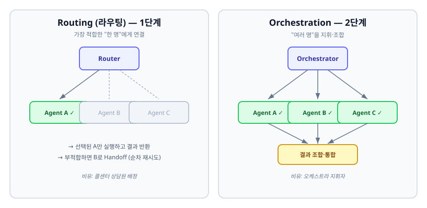
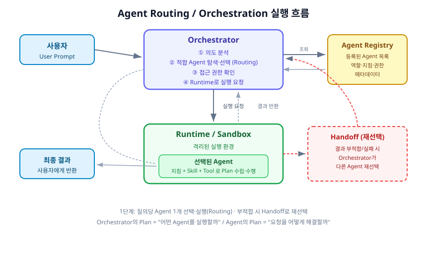

# Agent Orchestration & Routing

여러 개의 AI 에이전트를 하나의 시스템에서 다룰 때, "어떤 요청을 누구에게 보낼 것인가"와 "여러 에이전트를 어떻게 함께 일하게 할 것인가"를 결정하는 방법에 대한 노트다.

---

## 1. 정의

### Routing (라우팅)

**Routing**은 사용자의 요청 하나를 보고, 등록된 여러 에이전트 중에서 **가장 적합한 에이전트 하나를 골라 실행**하는 것이다.

> 비유: 콜센터에 전화를 걸면 안내 음성이 "카드 문의는 1번, 대출 문의는 2번"이라고 하고, 우리가 누른 번호에 따라 담당 상담원에게 연결된다. 여기서 "어떤 상담원에게 연결할지 정하는 교환대"가 바로 Router다. 상담원(에이전트)은 여럿이지만, 한 통화에서 실제로 응대하는 사람은 한 명이다.

### Orchestration (오케스트레이션)

**Orchestration**은 여러 에이전트를 **동시에 또는 순서대로 지휘하여, 각자의 결과를 조합해 하나의 복잡한 작업을 완성**하는 것이다.

> 비유: 오케스트라 지휘자를 떠올리면 된다. 지휘자는 직접 악기를 연주하지 않는다. 바이올린, 첼로, 관악기 연주자들에게 언제 무엇을 연주할지 지시하고, 그 소리들을 하나의 곡으로 합친다. 지휘자가 Orchestrator, 각 연주자가 Agent다.

### 두 개념의 관계

Routing은 Orchestration의 **가장 단순한 형태**다. "에이전트 하나만 고르는 오케스트레이션"이 곧 라우팅이라고 볼 수 있다. 실무에서는 보통 **라우팅부터 시작해서, 점점 여러 에이전트를 조합하는 오케스트레이션으로 확장**한다.

| 구분 | Routing | Orchestration |
|---|---|---|
| 실행되는 에이전트 수 | 요청당 1개 | 요청당 여러 개 |
| 핵심 질문 | "누구에게 보낼까?" | "여러 명을 어떻게 지휘·조합할까?" |
| 결과 처리 | 선택된 1명의 결과를 그대로 반환 | 여러 결과를 조합·통합 |
| 복잡도 | 낮음 | 높음 |
| 비유 | 콜센터 상담원 배정 | 오케스트라 지휘 |

---

## 2. 왜 필요한가

"에이전트 하나에 프롬프트를 아주 길게 써서 모든 일을 시키면 안 되나?"라는 의문이 들 수 있다. 실제로 초기에는 그렇게 만든다. 하지만 다루는 업무가 늘어나면 다음과 같은 문제가 생긴다.

- **전문성 저하**: 하나의 에이전트에게 "코드 리뷰도 하고, 회의록도 요약하고, 데이터도 분석해"라고 시키면, 프롬프트가 뒤섞여 각 작업의 품질이 모두 떨어진다. 사람도 한 명이 모든 부서 일을 겸임하면 각각을 어설프게 하게 되는 것과 같다.
- **유지보수 어려움**: 거대한 하나의 프롬프트/에이전트는 한 부분을 고치면 다른 부분이 망가지기 쉽다. 반대로 업무별로 에이전트를 나눠 두면, "회계 에이전트"만 따로 수정할 수 있다.
- **권한 분리의 어려움**: 어떤 업무는 민감한 데이터에 접근해야 하고, 어떤 업무는 그렇지 않다. 에이전트가 하나뿐이면 "이 요청에는 이 데이터 접근을 막는다" 같은 통제를 걸기 어렵다. 업무별로 에이전트를 나누면 각 에이전트에 딱 필요한 권한만 줄 수 있다.
- **확장의 어려움**: 새 업무를 추가할 때, 기존 거대 에이전트를 건드리지 않고 "새 에이전트를 하나 등록"하기만 하면 되는 구조가 훨씬 안전하고 빠르다.

즉, 라우팅·오케스트레이션은 **"업무별로 잘 쪼갠 전문 에이전트들"을 만들어 두고, 요청이 올 때마다 알맞은 담당자에게 배정하거나 여러 담당자를 지휘하기 위한 장치**다.

---

## 3. 구성요소

라우팅·오케스트레이션 시스템은 보통 다음 요소들로 이루어진다.

### Orchestrator (오케스트레이터 / 지휘자)

전체 흐름의 **중심 두뇌**다. 사용자의 요청을 받아 다음 일들을 한다.

- 사용자의 요청(Prompt)과 의도를 분석한다.
- 등록된 에이전트 중 적합한 것을 탐색·선택한다. (이 선택 로직이 곧 Router 역할)
- 선택된 에이전트가 이 요청을 처리할 **접근 권한**이 있는지 확인한다.
- 필요하면 다른 에이전트로 넘긴다(Handoff).
- 실제 실행을 실행 환경(Runtime)에 요청한다.

여기서 중요한 원칙은, **Orchestrator는 "무엇을 어떻게 할지"까지 세세하게 계획하지 않는다**는 것이다. Orchestrator는 "누구에게 맡길지"만 정하고, "그 일을 구체적으로 어떻게 풀지"는 선택된 에이전트에게 맡긴다. (이 역할 분리는 아래 5장에서 자세히 다룬다.)

### Agent Registry (에이전트 등록소)

시스템이 사용할 수 있는 **에이전트 목록과 그 정보(메타데이터)를 모아 둔 곳**이다. 각 에이전트에 대해 다음과 같은 정보를 담는다.

- 에이전트의 역할·설명(어떤 일을 하는가)
- 지침(Instruction)
- 사용할 수 있는 Skill / Tool
- 접근 가능한 데이터 범위·권한

Orchestrator는 요청을 받으면 이 등록소를 뒤져서 "이 요청에 가장 잘 맞는 에이전트가 누구인지" 찾는다.

> 비유: 회사의 "부서 안내 게시판"이라고 생각하면 된다. 어떤 민원이 들어왔을 때, 안내 데스크(Orchestrator)는 게시판(Registry)을 보고 "이건 회계팀 담당이네"라고 판단한다.

### Agent (에이전트)

실제로 **업무를 수행하는 실행 단위**다. 자신에게 주어진 지침과 Skill/Tool을 바탕으로, 주어진 요청을 어떻게 해결할지 스스로 계획(Plan)을 세우고 작업을 수행한 뒤 결과를 만든다. 하나의 에이전트가 기존의 개별 앱 하나를 대체하는 "업무 담당자"라고 이해하면 자연스럽다.

### Router (라우터 / 선택 로직)

Orchestrator 안에서 **"어떤 에이전트를 고를지"를 실제로 결정하는 부분**이다. 선택 방식에는 여러 가지가 있으며, 5장에서 자세히 다룬다.

### Handoff 메커니즘 (인계)

선택한 에이전트가 요청과 맞지 않거나 실패했을 때, **다른 에이전트로 작업을 넘기는 장치**다.

> 비유: 상담원에게 연결됐는데 "이건 제 담당이 아니라 다른 부서로 돌려드릴게요"라고 하며 전화를 넘기는 것과 같다.

### Runtime / 실행 환경

선택된 에이전트의 코드·설정을 받아 **실제로 돌리는 실행 환경**이다. 보통 안전을 위해 격리된 공간(Sandbox)에서 실행한다. 이 노트에서는 "선택된 에이전트가 여기서 실행된다"는 정도만 알아 두면 충분하다.

---

## 4. 처리 흐름

가장 기본적인 흐름(요청당 에이전트 1개를 실행하는 라우팅)은 다음과 같다.

1. **사용자 요청**: 사용자가 프롬프트를 입력한다.
2. **의도 분석**: Orchestrator가 요청의 의도를 파악한다. (예: "이건 데이터 분석 요청이구나")
3. **에이전트 탐색·선택 (Routing)**: 등록소를 조회해 적합한 에이전트를 고른다.
4. **권한 확인**: 선택된 에이전트가 이 요청·데이터에 접근할 권한이 있는지 확인한다.
5. **실행 요청**: Orchestrator가 실행 환경(Runtime)에 에이전트 실행을 요청한다.
6. **에이전트 내부 수행**: 선택된 에이전트가 자신의 지침과 Skill/Tool로 세부 계획을 세우고 작업을 수행한다.
7. **결과 반환**: 결과가 실행 환경 → Orchestrator → 사용자 순으로 되돌아온다.

### Handoff가 일어나는 경우

- 만약 6~7 과정에서 **결과가 요청을 충분히 만족시키지 못했다**고 판단되면, Orchestrator는 다른 에이전트를 다시 선택해 재시도한다.
- 이 흐름은 보통 이렇게 표현한다: **Agent A 실행 → 부적합/실패 판단 → Agent B 재선택 → Agent B 실행**.
- 초기 단계에서는 여러 에이전트를 동시에 돌리지 않고, 이렇게 **하나 실패하면 다음 하나를 시도하는 순차적 재선택**부터 구현하는 것이 단순하고 안전하다.

### 세션과 에이전트의 관계

한 가지 자주 헷갈리는 점: 에이전트는 **대화 세션에 영구적으로 고정되지 않는다.** 같은 대화 안에서도 첫 번째 질문과 두 번째 질문에 **서로 다른 에이전트가 선택될 수 있다.** 매 요청마다 "이번엔 누가 담당할지"를 다시 정하기 때문이다.

---

## 5. 핵심 개념

### 5.1 라우팅 방식 3가지

"어떤 에이전트를 고를지" 결정하는 방법은 크게 세 가지가 있다.

| 방식 | 동작 원리 | 장점 | 단점 |
|---|---|---|---|
| **규칙 기반 (Rule-based)** | "키워드에 '결제'가 있으면 결제 에이전트로" 같이 미리 정한 규칙으로 분기 | 빠르고 예측 가능, 비용 없음 | 규칙에 없는 요청은 처리 못 함, 유연성 낮음 |
| **의미 기반 (Semantic / Embedding)** | 요청 문장과 각 에이전트 설명을 벡터(숫자 배열)로 바꿔, 의미가 가장 가까운 에이전트를 선택 | 표현이 달라도 의미로 매칭 가능 | 임베딩 계산 필요, 애매한 경계에서 오분류 가능 |
| **LLM 기반 (LLM-as-router)** | LLM에게 "이 요청에 가장 적합한 에이전트를 골라줘"라고 직접 물어봄 | 가장 유연하고 똑똑함, 복잡한 의도도 이해 | 느리고 비용이 큼, 답이 매번 조금씩 다를 수 있음 |

> 실무 팁: 세 방식은 배타적이지 않다. 예를 들어 "명확한 키워드는 규칙으로 빠르게 처리하고, 애매한 것만 LLM에게 판단을 넘기는" 식으로 섞어 쓰는 경우가 많다.

**임베딩(Embedding)이 처음이라면**: 문장을 컴퓨터가 비교할 수 있도록 숫자 배열(벡터)로 바꾼 것이다. 의미가 비슷한 문장은 벡터도 가깝게 나온다. "고양이"와 "냐옹이"는 벡터가 가깝고, "고양이"와 "자동차"는 멀다. 이 "가까움"을 이용해 요청과 가장 잘 맞는 에이전트를 찾는 것이 의미 기반 라우팅이다.

### 5.2 오케스트레이션 패턴 4가지

여러 에이전트를 조합할 때 자주 쓰이는 패턴들이다.

| 패턴 | 설명 | 비유 |
|---|---|---|
| **순차 (Sequential)** | 에이전트 A의 결과를 B의 입력으로, B의 결과를 C의 입력으로 이어 붙임 | 컨베이어 벨트 조립 라인 |
| **병렬 (Parallel)** | 여러 에이전트를 동시에 돌리고 결과를 모음 | 여러 팀이 각자 조사 후 취합 |
| **계층 (Hierarchical)** | 상위 지휘자가 하위 에이전트들을 지시·관리 | 팀장이 팀원에게 업무 분배 |
| **이벤트 기반 (Event-driven)** | 특정 사건(이벤트)이 발생하면 관련 에이전트가 반응해서 동작 | 화재 경보가 울리면 소방 시스템 작동 |

Orchestrator가 상위에서 라우팅을 담당하고 개별 에이전트가 하위에서 실제 작업을 수행하는 구조는 **계층(Hierarchical) 패턴**에 해당한다.

### 5.3 계획(Plan)의 역할 분리 — 가장 중요한 원칙

오케스트레이션 설계에서 가장 자주 실수하는 지점이자, 반드시 지켜야 하는 원칙이다.

- **Orchestrator의 Plan** = "**어떤** 에이전트를 실행할 것인가"
- **Agent의 Plan** = "선택된 에이전트가 요청을 **어떻게** 해결할 것인가"

이 둘을 섞으면 안 된다. Orchestrator가 세부 실행 계획까지 다 짜 버리면, 에이전트는 단순 실행기로 전락하고 시스템 전체가 Orchestrator에 종속돼 유지보수가 어려워진다.

> 비유: 회사 안내 데스크(Orchestrator)는 "이 민원은 회계팀 담당"이라고만 판단하고 넘긴다. 회계 업무를 **구체적으로 어떻게 처리할지**는 회계팀(Agent)이 알아서 정한다. 안내 데스크가 회계 처리 방법까지 지시하려 들면, 안내 데스크가 모든 부서의 업무를 다 알아야 하는 이상한 구조가 된다.

### 5.4 단일 에이전트 vs 멀티 에이전트

- **1단계(단일 에이전트)**: 요청당 에이전트 하나만 골라 실행. 구조가 단순하고 디버깅이 쉽다. 대부분의 프로젝트는 여기서 시작하는 것이 옳다.
- **2단계(멀티 에이전트)**: 여러 에이전트를 순차·병렬로 조합하거나, 실행 계획을 동적으로 생성하거나, 한 에이전트 안에서 하위 에이전트(Subagent)를 부르는 등의 고도화. 처리 능력은 커지지만 복잡도·비용·디버깅 난이도가 급격히 올라간다.

> 원칙: **처음부터 멀티 에이전트로 가지 말 것.** 단일 에이전트 라우팅으로 운영 경험을 쌓은 뒤, 정말 필요한 부분만 멀티 에이전트로 확장하는 것이 안전하다.

---

## 6. 트레이드오프

설계할 때 반드시 저울질해야 하는 지점들이다.

### 라우팅 방식 선택의 트레이드오프

- **속도·비용 vs 유연성**: 규칙 기반은 빠르고 공짜지만 뻣뻣하다. LLM 기반은 똑똑하지만 느리고 비싸다. 요청의 다양성과 예산에 따라 균형점을 잡아야 한다.
- **예측 가능성 vs 지능**: 규칙 기반은 "이 입력엔 항상 이 에이전트"라서 결과가 일정하다. LLM 기반은 상황을 잘 이해하지만, 같은 입력에도 가끔 다른 판단을 내릴 수 있어 테스트가 어렵다.

### 단순함 vs 처리 능력

- 에이전트를 잘게 쪼갤수록 각각은 전문화되지만, 관리할 에이전트 수와 라우팅 판단의 부담이 늘어난다.
- 오케스트레이션을 정교하게 만들수록 복잡한 요청을 처리할 수 있지만, 실패 지점이 많아지고 "어디서 잘못됐는지" 추적하기 어려워진다.

### 비용·지연 vs 품질

- 여러 에이전트를 병렬로 돌리거나 LLM 라우터를 쓰면 품질은 오르지만, 매 요청마다 LLM 호출이 여러 번 일어나 **비용과 응답 지연**이 커진다.
- 반대로 지나치게 아끼면 엉뚱한 에이전트가 선택돼 결과 품질이 떨어진다.

### 잘못된 라우팅의 대가

- 라우팅이 틀리면, 그 뒤 과정이 아무리 완벽해도 결과는 쓸모없다. "회계 질문을 인사 에이전트에게 보낸" 셈이기 때문이다.
- 그래서 **라우팅 단계의 정확도**가 전체 시스템 품질에 매우 큰 영향을 준다. Handoff·재선택 장치는 이 위험을 줄이는 안전망이다.

---

## 7. 평가

라우팅·오케스트레이션이 잘 동작하는지 확인하려면 다음 관점으로 측정한다.

| 평가 항목 | 무엇을 보는가 | 확인 방법 예시 |
|---|---|---|
| **라우팅 정확도** | 요청이 올바른 에이전트로 갔는가 | 정답 에이전트가 있는 테스트 케이스로 정답률 측정 |
| **최종 결과 품질** | 사용자 요청을 실제로 만족시켰는가 | 결과에 대한 사람/자동 채점, 만족도 |
| **Handoff 빈도** | 재선택이 얼마나 자주 일어나는가 | 재선택 발생률(너무 높으면 라우팅이 부실하다는 신호) |
| **응답 지연 (Latency)** | 결과까지 걸리는 시간 | 요청~응답 시간 측정 |
| **비용 (Cost)** | 요청당 LLM 호출 수·토큰 소비 | 요청당 평균 토큰·호출 횟수 집계 |
| **실패·복구율** | 실패했을 때 재선택으로 회복하는가 | 첫 시도 실패 후 최종 성공한 비율 |

> 핵심 지표 두 가지만 고르라면 **라우팅 정확도**와 **최종 결과 품질**이다. 라우팅이 맞아야 뒤가 의미 있고, 결국 사용자가 보는 것은 최종 결과이기 때문이다. 여기에 **비용·지연**을 함께 보면서, "품질을 얼마의 비용·시간으로 얻고 있는가"의 균형을 관리한다.

---

## 한눈에 정리

- **Routing** = 요청 하나를 가장 적합한 에이전트 **한 명**에게 배정 (콜센터 상담원 배정)
- **Orchestration** = **여러 에이전트**를 지휘·조합 (오케스트라 지휘)
- **Orchestrator**는 "누구에게 맡길지"만 정하고, "어떻게 풀지"는 에이전트에게 맡긴다 (Plan의 역할 분리)
- 라우팅 방식은 **규칙 기반 / 의미 기반 / LLM 기반**, 필요하면 섞어 쓴다
- **단일 에이전트 라우팅부터 시작**해서 멀티 에이전트 오케스트레이션으로 확장하는 것이 안전하다
- 가장 중요한 평가 지표는 **라우팅 정확도**와 **최종 결과 품질**이다