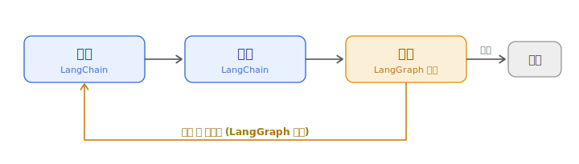

# LangChain & LangGraph

> LLM 애플리케이션을 만드는 대표적인 도구 두 가지. 같은 회사(LangChain Inc.)의 **상호 보완적인 두 계층**이다.
> 한 줄 요약: **"LangChain은 부품 상자(조립), LangGraph는 실행 엔진(제어)."**

> 관련 노트: LLM(모델 자체) · RAG(지식 주입) · Harness(에이전트 구조) — 이 문서는 그 하네스를 **실제로 구현하는 도구**에 해당한다.

---

## 1. 생태계 개요

가장 흔한 오해는 "LangChain vs LangGraph, 둘 중 뭘 골라야 하나?"라고 생각하는 것이다.
정답은 **"고르는 게 아니라 겹쳐 쓰는 것"** 이다. 둘은 경쟁자가 아니라 **위아래로 쌓이는 계층**이다.

| 계층 | 이름 | 역할 |
|------|------|------|
| 조립(framework) 층 | **LangChain** | 프롬프트·모델·리트리버·도구 등 **부품**과 그 연결 |
| 실행(runtime) 층 | **LangGraph** | 그 부품들을 **상태·루프·분기**를 가진 흐름으로 돌리는 엔진 |

- **LangGraph는 LangChain 위에 얹혀 동작**한다. 실제로 LangChain의 에이전트 생성 함수(`create_agent`)는 내부적으로 LangGraph 엔진 위에서 돌아간다.
- 그래서 "LangGraph를 쓴다 = LangChain을 버린다"가 아니다. **LangChain 부품을 LangGraph 흐름 안에서 쓰는** 경우가 실전에서 가장 흔하다.

> 비유: **LangChain은 레고 블록 세트**(모델·프롬프트·검색기 등 조립 부품),
> **LangGraph는 그 블록으로 만든 기계를 실제로 굴리는 모터·기어 장치**(멈추고, 되돌아가고, 조건에 따라 갈라지는 제어).

---

## 2. LangChain — 조립(framework) 층

### 2.1 무엇인가

LLM 앱에 필요한 **공통 부품들을 모듈로 제공**하고, 그것들을 이어 붙이기 쉽게 해주는 프레임워크다.
2022년 말 등장해 "프롬프트·모델·도구를 연결(chain)한다"는 개념의 표준이 되었다.

### 2.2 핵심 구성요소

| 부품 | 역할 |
|------|------|
| **Chat Models** | OpenAI·Anthropic·Google 등 여러 모델을 **같은 인터페이스**로 호출 (코드 재작성 없이 교체 가능) |
| **Prompts** | 프롬프트 템플릿 관리 (변수 삽입, 재사용) |
| **Output Parsers** | 모델의 텍스트 응답을 구조화된 데이터(JSON 등)로 변환 |
| **Retrievers** | 문서 검색기. RAG의 검색 부분을 담당 |
| **Vector Store 통합** | FAISS·Chroma·Pinecone 등 벡터 DB 연결 |
| **Tools** | 모델이 호출할 수 있는 외부 기능 정의 |
| **통합(Integrations)** | 700개 이상의 외부 서비스·DB 커넥터 |

> 가장 큰 실용적 장점: **모델·DB·도구를 갈아끼워도 코드를 거의 안 바꿔도 된다** (provider-agnostic).

#### 참고: 벡터 DB(FAISS · Chroma · Pinecone)란?

위 표의 "Vector Store 통합"에 나오는 것들. 셋 다 임베딩 벡터를 저장하고 유사한 것을 찾아주는 **벡터 DB**지만, 형태가 다르다.

| 이름 | 형태 | 특징 |
|------|------|------|
| **FAISS** | 라이브러리 (엄밀히는 DB가 아님) | 메타(구 페이스북)의 오픈소스. 내 서버/메모리에서 직접 구동. 빠르고 무료, 소규모·로컬에 적합 |
| **Chroma** | 오픈소스 벡터 DB | 설치·사용이 간단. 로컬 개발·프로토타이핑에 인기 |
| **Pinecone** | 관리형(클라우드) 서비스 | 인프라 관리 불필요, API로 사용. 대규모·운영 환경에 적합 (유료) |

핵심 차이는 **"내가 직접 돌리느냐(FAISS·Chroma) vs 남이 운영해주는 걸 쓰느냐(Pinecone)"** 다.
이 외에 pgvector(PostgreSQL 확장), Weaviate, Qdrant, Milvus 등도 있다.
보통 **로컬(Chroma·FAISS)로 익히고 규모가 커지면 관리형(Pinecone 등)으로** 옮기는 흐름이 흔하다.

### 2.3 LCEL (LangChain Expression Language)

LangChain에서 부품을 이어 붙이는 표현 방식. **파이프 연산자 `|`** 로 데이터 흐름을 연결한다.

```python
# 개념 예시: 프롬프트 → 모델 → 파서를 파이프로 연결
chain = prompt | model | output_parser
result = chain.invoke({"question": "RAG가 뭐야?"})
```

- 데이터가 **한 방향으로만** 흐르는 구조(DAG, 방향성 비순환 그래프)를 만든다.
- **강점**: 선형 파이프라인에 간결하고 직관적. RAG·단순 도구 호출·데이터 추출에 적합.
- **한계**: **루프(반복)를 만들 수 없다.** "실패하면 재시도", "스스로 비판하고 수정" 같은 건 억지로 끼워 넣어야 한다 → 이 지점이 LangGraph로 넘어가는 신호다.

### 2.4 create_agent (1.0의 새 관문)

**새로운 기술이나 패러다임이 아니라, LangChain이 제공하는 함수(API)** 다.
"에이전트를 만드는 미리 포장된 방법"이라고 보면 된다.

에이전트를 직접 만들려면 "모델 호출 → 도구 선택 → 실행 → 결과 보고 다시 판단"하는 루프를 일일이 짜야 하는데,
`create_agent`는 **이 표준 루프를 이미 만들어 함수 하나로 제공**한다. 그래서 모델과 도구만 넘기면 동작하는 에이전트를 몇 줄로 얻는다.

```python
# 개념 예시: 모델과 도구만 주면 에이전트가 만들어짐
agent = create_agent(model, tools=[검색도구, 계산도구])
result = agent.invoke({"messages": [("user", "3분기 매출 찾아서 합계 내줘")]})
```

- LangChain 1.0에서 **에이전트를 만드는 표준 방법**으로 자리 잡았다 (빠른 길, fast path).
- 내부적으로는 LangGraph 엔진 위에서 돌아간다. 즉 **겉은 LangChain, 속은 LangGraph.**
- 커스텀 제어(복잡한 분기·상태)가 필요하면 create_agent 대신 LangGraph의 `StateGraph`를 직접 쓴다.
- 참고: 예전의 `AgentExecutor`는 폐기(deprecated) 상태다 (아래 5장).

---

## 3. LangGraph — 실행(runtime) 층

### 3.1 무엇인가

에이전트의 실행 흐름을 **그래프(노드 + 엣지)** 로 정의하는 오케스트레이션 런타임이다.
LCEL의 한계(직선 흐름, 루프 불가)를 넘어서기 위해 만들어졌다.

- **노드(Node)**: 하나의 작업 단위 (함수 또는 에이전트).
- **엣지(Edge)**: 노드 사이의 전이(다음에 어디로 갈지). 조건부 분기 가능.
- 그래서 **직선이 아니라 순서도**처럼 생겼다 — 갈라지고, 되돌아오고, 멈췄다 다시 갈 수 있다.

> 비유: LCEL이 **조립 라인**(입구에서 출구로 한 방향)이라면,
> LangGraph는 **대기실과 되돌아가는 길이 있는 순서도**다.

### 3.2 핵심 기능 (LangGraph만의 강점)

| 기능 | 설명 |
|------|------|
| **Cycles (사이클/루프)** | 재계획·재시도·자기수정처럼 **같은 단계를 반복**할 수 있다 |
| **Persistent State (영속 상태)** | 진행 상황을 상태로 들고 다니며, 여러 턴·여러 노드에 걸쳐 유지 |
| **Checkpointing (체크포인트)** | 상태를 저장해 **실패해도 이어서 재개**하거나 되감기 가능 |
| **Human-in-the-loop** | 실행 중간에 **멈추고 사람 승인/입력**을 기다렸다가 계속 |
| **Multi-Agent** | 역할이 다른 여러 에이전트가 협업하도록 조율 |
| **Time-travel 디버깅** | 과거 상태로 돌아가 다른 경로를 다시 실행 |

### 3.3 StateGraph (핵심 개념)

LangGraph의 중심은 **상태(State)를 공유하며 도는 그래프**다.

```python
# 개념 예시: 상태 그래프의 뼈대
graph = StateGraph(State)
graph.add_node("plan", plan_fn)        # 계획 노드
graph.add_node("act", act_fn)          # 실행 노드
graph.add_node("check", check_fn)      # 검증 노드
graph.add_conditional_edges(           # 검증 결과에 따라 분기
    "check",
    lambda s: "act" if s["failed"] else "END"  # 실패면 다시 실행, 아니면 종료
)
```

- 위 예시의 `check → act` 되돌아가는 화살표가 바로 **루프(사이클)** 다. LCEL로는 만들 수 없는 부분.
- Harness 노트에서 본 "관찰 → 판단 → 행동 → 피드백" 루프를 **코드로 표현한 것**이 StateGraph라고 보면 된다.

#### StateGraph는 함수인가?

함수라기보단 **"함수들을 엮는 설계도(순서도/상태 기계)"** 에 가깝다. 세 가지로 나눠보면 명확하다.

- **노드(node) 하나하나가 함수다** — 검색 함수, 생성 함수, 검증 함수 등.
- **StateGraph는 그 함수들을 어떤 순서·조건으로 연결할지 정의하는 그래프 구조다** — 개별 함수가 아니라 그것들을 엮는 틀.
- **State(상태)** — 그래프 전체를 관통하며 흐르는 공유 객체. 각 노드가 이걸 읽고 갱신하며 진행한다. 그래서 이름이 **State**Graph다.

> 비유: 노드가 **직원들**이라면, StateGraph는 **업무 흐름도**, State는 그 사이를 도는 **결재 서류철**이다.
> 서류철(상태)에 지금까지의 진행 내용이 담겨 다음 사람에게 넘어간다.

---

## 4. 언제 무엇을 쓰나 (핵심)

이 문서에서 가장 중요한 부분. 판단 기준은 의외로 단순하다.

> **핵심 질문: "내 작업에 루프(또는 사람 대기)가 필요한가?"**
> - 직선이거나 단순 반복이면 → **LangChain (LCEL)**
> - `while` 루프·분기·중간 멈춤·상태 유지가 필요하면 → **LangGraph**

### 4.1 결정 기준표

| 상황 | 추천 | 이유 |
|------|------|------|
| RAG 파이프라인 (검색→프롬프트→생성) | **LangChain** | 한 방향 선형 흐름 |
| 단일 턴 Q&A, 데이터 추출, 요약 | **LangChain** | 루프 불필요, 더 간결·빠름 |
| 빠른 프로토타이핑 | **LangChain** (`create_agent`) | 최소 코드로 동작 |
| 실패 시 재시도·자기수정 루프 | **LangGraph** | 사이클 필요 |
| 조건에 따라 경로가 갈라짐 | **LangGraph** | 조건부 분기 필요 |
| 중간에 사람 승인이 필요 | **LangGraph** | human-in-the-loop |
| 여러 에이전트 협업(작성↔검토) | **LangGraph** | 멀티 에이전트 조율 |
| 실패해도 이어서 재개해야 함 | **LangGraph** | 체크포인트/영속 상태 |

### 4.2 함께 쓰는 패턴 (실전 다수)

실무 프로덕션에서는 대개 **둘을 겹쳐서** 쓴다.

- **LangChain**이 부품을 공급: 모델 호출(ChatOpenAI 등), 검색기, 벡터 DB 커넥터, 도구 정의.
- **LangGraph**가 실행을 통제: 그 부품들을 노드로 배치하고, 루프·분기·상태로 흐름을 제어.
- 즉 **"LangGraph 노드 안에서 LangChain 컴포넌트를 호출"** 하는 구조.

> **오해 주의 — "단방향 LangChain을 사이클로 바꾸는 것"이 아니다.**
> LangChain 부품(검색·생성)은 여전히 한 방향으로 동작하는 **부품(노드)** 으로 남는다.
> 루프는 LangChain을 개조해서 나오는 게 아니라, **LangGraph가 그 노드들을 감싸서 "검증 실패 시 다시 검색으로" 같은 되돌아가는 화살표를 만들기** 때문에 생긴다.
> 정리하면: **부품은 그대로(LangChain), 그 위의 흐름 제어를 LangGraph가 맡는다.**



*파란 노드 = LangChain 부품 · 주황 화살표 = LangGraph가 만드는 루프*

### 4.3 흔한 실수

- 5단계짜리 단순 RAG에 LangGraph를 쓴다 → 필요 없는 **복잡성 비용**을 낸다.
- 반대로 멀티 에이전트·자기수정을 LCEL에 억지로 욱여넣는다 → **깨지기 쉬운 코드**가 된다.
- 권장 흐름: **LCEL로 단순하게 시작 → 루프/자기수정을 억지로 끼워 넣게 되는 순간이 LangGraph로 옮길 신호.**

> 두 프레임워크를 아예 안 쓰는 선택지도 있다. 요구가 아주 단순하면 SDK를 직접 호출하는 게 더 가벼울 수 있다.

### 4.4 구체적인 프로젝트 예시

실제 프로젝트로 보면 감이 빠르다.

**LangChain으로 충분한 프로젝트** (직선 흐름, 루프 불필요)

| 프로젝트 | 흐름 |
|----------|------|
| 사내 문서 Q&A 봇 | 질문 → 문서 검색 → 답변 (전형적 RAG) |
| PDF·회의록 요약기 | 문서 입력 → 요약 출력 |
| 리뷰 감정 분석 배치 | 리뷰 → 분류 결과 |
| 번역·문체 변환 도구 | 입력 → 변환 → 출력 |
| 단일 턴 FAQ 챗봇 | 한 번 묻고 한 번 답하면 끝 |

**LangGraph가 필요한 프로젝트** (루프·분기·사람 개입·상태)

| 프로젝트 | 왜 LangGraph인가 |
|----------|-------------------|
| 코딩 에이전트 | 코드 작성 → 테스트 → 실패 시 수정 **반복** |
| 리서치 에이전트 | 검색 → 충분한지 평가 → 부족하면 **다시 검색** (자기수정) |
| 고객 지원 에이전트 | 환불액이 크면 중간에 멈춰 **사람 승인** 대기 |
| 보고서 작성 멀티 에이전트 | 작성자 ↔ 검토자가 **주고받으며** 완성 |
| 여행 계획 에이전트 | 여러 단계 + **조건 분기** + 중간 확인 |

> 흔한 판단 흐름: **LangChain(단순 RAG)으로 시작 → "실패하면 재시도", "스스로 검토·수정", "중간에 사람 확인"이 필요해지는 순간이 LangGraph로 넘어갈 신호.**
> 예: "사내 문서 Q&A 봇"은 LangChain으로 시작했다가, "답이 부실하면 다른 문서를 더 찾아 다시 답하게" 만들고 싶어지면 그때 LangGraph를 얹는다.

---

## 5. 버전 · 마이그레이션 노트 (2026 기준)

빠르게 변하는 영역이라 시점을 함께 기록해둔다. (아래는 2026년 중반 기준)

- **동시 1.0 출시**: LangChain과 LangGraph가 **2025년 10월 22일** 함께 정식(1.0) 버전에 도달했다. 문서 사이트도 개편됨.
- **버전 상황**: `langchain-core`는 1.4.x 대, LangGraph는 1.2.x 대.
- **`AgentExecutor` 폐기**: 예전 방식인 `AgentExecutor`는 유지보수 모드로, **2026년 12월 전 마이그레이션**이 권장된다. 새 프로젝트는 `create_agent`(간단) 또는 LangGraph의 `StateGraph`(커스텀 제어)를 쓴다.
- **LCEL의 위치 변화**: LCEL은 여전히 선형 체인에 유효하지만, "모든 걸 LCEL로"는 더 이상 기본 권장이 아니다. 에이전트는 `create_agent` / LangGraph가 표준.

> ⚠️ 버전·권장 방식은 계속 바뀐다. 실제 적용 전 공식 문서에서 현재 버전을 재확인할 것.

---

## 6. 요약

| | LangChain | LangGraph |
|---|---|---|
| 한마디 | 부품 상자(조립) | 실행 엔진(제어) |
| 흐름 | 한 방향(DAG), 루프 불가 | 그래프, 루프·분기 가능 |
| 상태 | 기본적으로 stateless | 영속 상태·체크포인트 |
| 대표 API | LCEL(`\|`), `create_agent` | `StateGraph` |
| 적합 | RAG·추출·단일 턴 | 에이전트·자기수정·멀티 에이전트·사람 개입 |
| 관계 | 하위 프레임워크 | 그 위에 얹힌 런타임 |

**기억할 한 줄**: 직선이면 LangChain, 루프·대기·상태가 필요하면 LangGraph. 그리고 대부분은 **둘 다** 쓴다.

---

## 7. 참고자료

- LangChain 공식 문서 (개념 가이드, LCEL, create_agent)
- LangGraph 공식 문서 (StateGraph, 체크포인트, human-in-the-loop)
- LangGraph Studio — 그래프 시각화·디버깅 도구
- 관련 개념: ReAct 패턴, 하네스 엔지니어링 (→ Harness 노트)

---

*본 문서는 개인 학습 정리 노트입니다. 버전 정보는 2026년 중반 기준이며 변동 가능.*