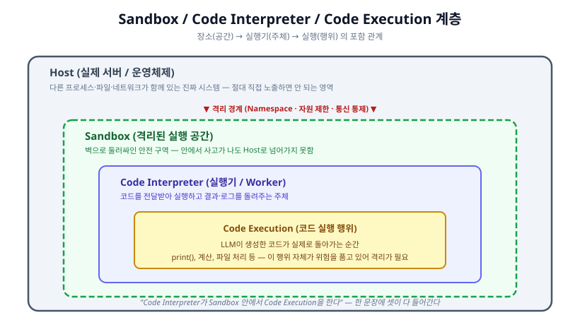
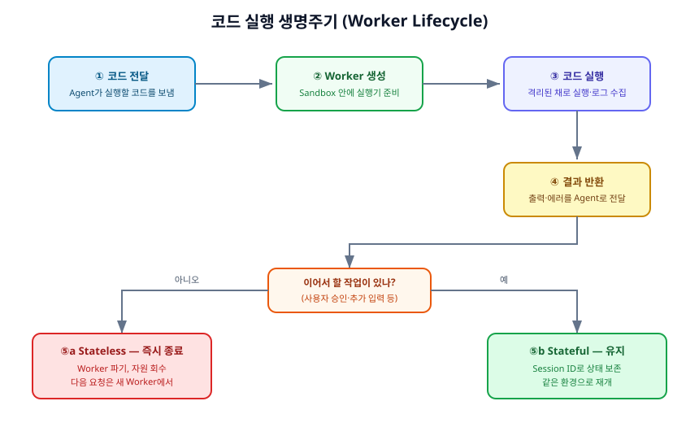

# Sandbox & Code Execution

AI 에이전트가 스스로 만든 코드를 실행할 때, **그 코드를 어디서 어떻게 안전하게 돌릴 것인가**에 대한 노트다. 격리 환경(Sandbox), 실행기(Code Interpreter), 실행 행위(Code Execution)의 관계와 동작 원리를 다룬다.

---

## 1. 정의

먼저 자주 뒤섞여 쓰이는 세 용어를 층위별로 나눈다. 이 셋은 **경쟁하는 개념이 아니라, 서로 포함 관계에 있는 다른 층위의 것들**이다.

| 용어 | 무엇인가 | 층위 | 비유 |
|---|---|---|---|
| **Sandbox** | 코드를 안전하게 돌리기 위한 격리된 실행 공간 | 장소 | 방음·방화 처리된 실험실 |
| **Code Execution** | 코드가 실제로 실행되는 행위·과정 | 행위 | 실험을 수행하는 것 |
| **Code Interpreter** | Sandbox 안에서 코드를 받아 실행하는 실행기 | 주체 | 실험을 수행하는 연구원 |

한 문장으로 묶으면 이렇게 된다:

> **"Code Interpreter가 Sandbox 안에서 Code Execution을 한다."**

### 각각을 조금 더 풀어보면

- **Code Execution (코드 실행)**: LLM이 만들어낸 코드가 실제로 돌아가는 순간이다. 계산을 하고, 파일을 읽고, 결과를 출력한다. AI 에이전트가 "직접 코드를 짜서 문제를 푸는" 능력의 핵심이지만, **바로 이 실행 행위가 위험을 품고 있다.**
- **Sandbox (샌드박스)**: 그 위험한 실행을 **바깥 시스템과 격리된 공간 안에 가둬 두는 환경**이다. 안에서 무슨 일이 터져도 실제 서버(Host)로 피해가 번지지 않도록 벽을 세워 둔다.
- **Code Interpreter (코드 인터프리터)**: Sandbox 안에서 실제로 **코드를 전달받아 실행하고, 결과와 로그를 돌려주는 컴포넌트**다.

---

## 2. 왜 필요한가

"에이전트가 만든 코드를 그냥 서버에서 실행하면 안 되나?"라는 의문에서 출발하자. 답은 **매우 위험하기 때문에 안 된다**이다.

에이전트가 실행하는 코드는 **사람이 검토하지 않은, LLM이 방금 생성한 코드**다. 이 코드는 다음과 같은 이유로 신뢰할 수 없다.

- **실수로 시스템을 망가뜨릴 수 있다**: LLM이 의도치 않게 중요한 파일을 지우거나 덮어쓰는 코드를 만들 수 있다.
- **무한 루프·자원 폭주**: 끝나지 않는 반복문이나 메모리를 무한정 먹는 코드가 서버 전체를 마비시킬 수 있다.
- **민감 정보 유출**: 코드가 서버의 다른 데이터에 접근해 외부로 빼돌릴 수 있다.
- **악의적 조작(프롬프트 인젝션)**: 사용자가 교묘하게 유도해, 에이전트가 해서는 안 될 코드를 생성·실행하게 만들 수 있다.

만약 이 코드를 **격리 없이 실제 서버에서 그대로 실행**하면, 위 사고 하나만으로도 서버 전체·다른 사용자 데이터·외부 시스템까지 피해가 번진다.

그래서 **"실행은 시키되, 사고가 나도 그 피해를 좁은 공간 안에 가둔다"**는 발상이 필요하다. 이것이 Sandbox의 존재 이유다.

> 비유: 위험한 화학 실험을 사무실 한복판에서 하지 않는다. 방음·방화·환기 장치가 갖춰진 **실험실 안에서만** 한다. 폭발이 일어나도 실험실 벽이 막아 주기 때문이다. Sandbox가 바로 그 실험실이다.

---

## 3. 구성요소

격리 실행 시스템은 보통 다음 요소들로 이루어진다.

### Host (호스트)

실제 서버와 운영체제다. 다른 프로세스, 파일, 네트워크가 함께 있는 **진짜 시스템**이며, 절대 코드에 직접 노출되면 안 되는 보호 대상이다.

### Sandbox (격리 공간)

Host 위에 세운 **격리된 실행 구역**이다. 안쪽의 코드가 Host의 다른 프로세스나 자원에 함부로 손대지 못하도록 벽을 세운다. 이 벽은 뒤에 나올 격리 기술(Namespace 등)로 구현한다.

### Code Interpreter / Worker (실행기)

Sandbox 안에서 **실제로 코드를 실행하는 일꾼**이다. 코드를 받아 실행하고, 표준 출력·에러·로그를 수집해 돌려준다. 흔히 요청마다 하나씩 생성되는 실행 단위를 **Worker**라고 부른다.

### 자원 제한 장치

Worker가 쓸 수 있는 **CPU·메모리·실행 시간의 상한**을 정해 두는 장치다. 무한 루프나 메모리 폭주가 일어나도, 상한을 넘으면 강제로 멈춰서 Host를 보호한다.

### 외부 통신 통제 (Connector)

Sandbox 안에서는 기본적으로 바깥 네트워크 접근을 막고, **허용된 통로(Connector)를 통해서만** 제한적으로 외부와 통신하게 한다. 코드가 몰래 데이터를 외부로 보내는 것을 막기 위함이다.

### 상태·로그 관리

각 실행의 상태(진행 중, 종료됨 등)와 로그를 기록·관리한다. 문제 추적과 뒤에 나올 상태 유지(Stateful) 실행에 쓰인다.

---

## 4. 처리 흐름

코드 한 번을 실행하는 기본 생명주기(Lifecycle)는 다음과 같다.

1. **코드 전달**: 에이전트가 실행할 코드를 실행 시스템에 보낸다.
2. **Worker 생성**: Sandbox 안에 코드를 돌릴 실행기(Worker)를 준비한다.
3. **코드 실행**: 격리된 상태로 코드를 실행하며, 출력·에러·로그를 수집한다.
4. **결과 반환**: 실행 결과를 에이전트로 돌려준다.
5. **종료 또는 유지**: 이어서 할 작업이 없으면 Worker를 파기하고, 있으면 상태를 유지한다. (아래 5.4에서 자세히)

핵심은 **모든 실행이 Sandbox라는 벽 안에서만 일어난다**는 점이다. 코드가 아무리 위험해도, 그 영향은 이 Worker와 Sandbox 안으로 제한된다.

---

## 5. 핵심 개념

### 5.1 Namespace — "무엇을 볼 수 있는가"를 격리

**Linux Namespace**는 프로세스가 **볼 수 있는 시스템 자원의 범위를 분리**하는 기술이다. 같은 서버 위에서 돌더라도, Namespace로 격리된 프로세스는 자신만의 독립된 세계를 보게 된다.

> 비유: 여러 세입자가 한 건물에 살지만, 각 집에는 자기 집 현관·방·창문만 보인다. 옆집 내부는 보이지도 들어갈 수도 없다. Namespace가 바로 이 "각자의 집"을 만들어 준다.

Namespace로 격리하면 Sandbox 안의 프로세스는 Host의 다른 프로세스 목록, 파일 시스템, 네트워크 등에 **직접 접근하기 어렵게** 된다.

### 5.2 자원 제한 — "얼마나 쓸 수 있는가"를 제한

Namespace가 "무엇을 볼 수 있는가"를 나눈다면, 자원 제한은 **"CPU·메모리·시간을 얼마나 쓸 수 있는가"에 상한**을 건다.

- 메모리를 정한 양 이상 쓰면 중단시킨다.
- 실행 시간이 정한 초를 넘으면 강제 종료한다(무한 루프 방어).
- CPU 사용도 일정 비율로 제한한다.

이렇게 하면 폭주하는 코드가 Host 전체 자원을 삼키는 것을 막을 수 있다.

### 5.3 시스템 접근·통신 제한 — "무엇을 할 수 있는가"를 통제

격리된 코드가 위험한 시스템 기능을 호출하거나, 바깥으로 몰래 통신하는 것을 막는다.

- 위험한 시스템 명령 호출을 차단한다.
- 외부 네트워크는 기본 차단하고, 허용된 Connector로만 제한적으로 연다.

즉 격리는 **① 볼 수 있는 것(Namespace) ② 쓸 수 있는 양(자원 제한) ③ 할 수 있는 행위(접근·통신 통제)** 세 방향에서 함께 걸어야 견고해진다.

### 5.4 Stateless vs Stateful 실행 — 실행 후 환경을 버릴까, 남길까

에이전트 작업 중에는 **한 번 실행하고 끝나는 것**도 있고, **사용자의 추가 입력이나 승인을 기다렸다가 이어서 해야 하는 것**도 있다. 이 차이가 실행 방식을 가른다.

| 방식 | 실행 후 | 다음 요청 | 언제 쓰나 |
|---|---|---|---|
| **Stateless (무상태)** | Worker를 즉시 파기, 자원 회수 | 완전히 새 Worker에서 처음부터 | 한 번에 끝나는 단순 실행 |
| **Stateful (상태 유지)** | Worker를 종료하지 않고 유지 | Session ID로 같은 환경 재개 | 승인 대기, 여러 단계 이어지는 작업 |

**Stateful이 필요한 대표 상황 — Human-in-the-loop (사람 개입)**

에이전트가 위험하거나 중요한 작업을 하기 전에 **사람의 승인**을 받아야 할 때가 있다. 이때 흐름은 이렇다:

> 에이전트 실행 → 사용자 승인 필요 → **상태 유지** → 사용자 응답 → **같은 Session으로 재개**

만약 실행 환경을 매번 버린다면(Stateless), 사용자가 승인하는 사이에 그때까지 만든 변수·중간 결과가 다 사라진다. 그래서 승인을 기다리는 동안 환경을 **유지**하고, 반환된 **Session ID**로 같은 환경에 다시 요청을 보내 이어가는 것이다.

이 상태를 안전하게 보관하기 위해 **Checkpoint 저장소**나 **Redis** 같은 외부 상태 저장소를 함께 쓰기도 한다.

> 비유: Stateless는 실험 한 번 하고 실험실을 통째로 청소·초기화하는 것이다. Stateful은 "잠깐, 실험 도중인데 부장 승인 받고 올게" 하며 실험 상태를 **그대로 두고** 자리를 비웠다가, 돌아와서 이어 하는 것이다.

### 5.5 Worker 생명주기

Worker는 요청마다 생성·종료되는 실행 단위다. Stateless면 실행 직후 파기되고, Stateful이면 세션이 유지되는 동안 살아 있다. 이 생성·유지·종료를 관리하는 것이 실행 시스템의 중요한 역할이다.

---

## 6. 트레이드오프

설계할 때 반드시 저울질해야 하는 지점들이다.

### 격리 강도 vs 성능·속도

- 격리를 강하게 걸수록(더 두꺼운 벽) 안전하지만, 실행 준비가 무거워지고 느려진다.
- 약하게 걸면 빠르지만 사고 위험이 커진다.
- 격리 방식은 대체로 **Namespace 기반(가벼움) → 컨테이너 → 가상머신(무겁고 강력)** 순으로 격리는 강해지고 속도는 느려진다. 다루는 코드의 위험도에 맞춰 고른다.

### Cold Start(시작 지연) vs 상시 유지

- 요청이 올 때마다 Worker를 새로 만들면 자원은 아끼지만, 매번 준비 시간(Cold Start)이 든다.
- 미리 Worker를 띄워 두면 빠르지만, 놀고 있는 동안에도 자원을 점유한다.

### Stateful의 편리함 vs 자원 점유

- Stateful은 이어지는 작업·승인 대기에 편리하지만, 세션이 유지되는 동안 **Sandbox가 계속 자원을 붙잡고 있다.**
- 세션이 방치되면 자원이 새므로, **유효 시간(timeout)**을 두고 오래된 세션을 정리하는 정책이 필요하다.

### 통제 강도 vs 기능성

- 외부 통신·시스템 접근을 강하게 막을수록 안전하지만, 정작 필요한 기능(예: 허용된 API 호출)까지 막혀 에이전트가 일을 못 할 수 있다.
- "무엇을 허용하고 무엇을 막을지"의 경계를 업무에 맞게 잡는 것이 설계의 핵심이다.

---

## 7. 평가

격리 실행 시스템이 잘 동작하는지 확인하려면 다음 관점으로 측정한다.

| 평가 항목 | 무엇을 보는가 | 확인 방법 예시 |
|---|---|---|
| **격리 견고성** | 코드가 Sandbox 밖으로 빠져나가지 못하는가 | 일부러 탈출·접근을 시도하는 테스트로 차단 여부 확인 |
| **자원 상한 준수** | 폭주 코드가 상한에서 멈추는가 | 무한 루프·대용량 메모리 코드로 강제 중단 확인 |
| **시작 시간 (Cold Start)** | 실행 준비에 걸리는 시간 | Worker 생성~실행 시작까지 측정 |
| **처리량 (Throughput)** | 동시에 얼마나 많은 실행을 감당하는가 | 동시 요청 수를 늘려가며 처리 성능 측정 |
| **상태 복구 정확성** | Stateful 재개 시 이전 상태가 온전한가 | 승인 대기 후 재개해 중간 결과 보존 여부 확인 |
| **자원 회수** | 종료된 Worker가 자원을 제대로 반납하는가 | 반복 실행 후 자원 누수 여부 점검 |

> 핵심 지표 두 가지만 고르라면 **격리 견고성**과 **자원 상한 준수**다. 이 둘이 곧 "사고가 나도 피해가 번지지 않는다"를 보장하는 안전의 핵심이기 때문이다. 여기에 **시작 시간·처리량**을 함께 보며 "안전을 얼마의 속도·비용으로 얻고 있는가"의 균형을 관리한다.

---

## 한눈에 정리

- **Sandbox** = 격리된 실행 **공간** / **Code Interpreter** = 그 안의 **실행기** / **Code Execution** = 실행 **행위** (장소·주체·행위의 층위)
- LLM이 만든 코드는 신뢰할 수 없으므로, **사고가 나도 피해를 좁은 공간에 가두기 위해** 격리 실행이 필요하다
- 격리는 **① Namespace(볼 수 있는 것) ② 자원 제한(쓸 수 있는 양) ③ 접근·통신 통제(할 수 있는 행위)** 세 방향으로 함께 건다
- **Stateless**는 실행 후 버리고, **Stateful**은 Session ID로 상태를 유지해 승인 대기·다단계 작업(Human-in-the-loop)을 이어간다
- 가장 중요한 평가 지표는 **격리 견고성**과 **자원 상한 준수**다